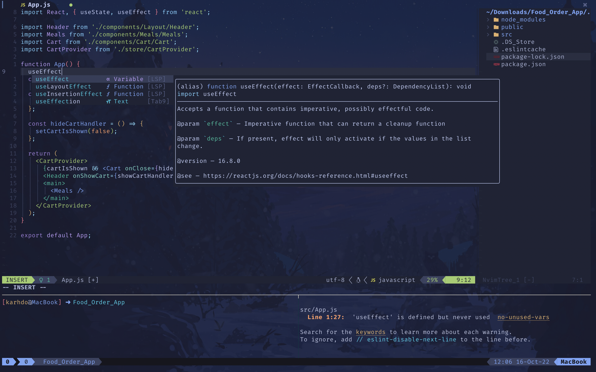

# Karhdo's dotfiles

## Contents

- [NeoVim config](#neovim-setup)
- [tmux config](#tmux-setup)
- [git config](#git-setup)
- [wezterm config](#wezterm-setup)
- [Shell setup](#shell-setup)

## Neovim setup

Requires [Neovim](https://neovim.io/) (>= 0.8)

### Plugins

- [williamboman/mason.nvim](https://github.com/williamboman/mason.nvim)
- [mfussenegger/nvim-lint](https://github.com/mfussenegger/nvim-lint)
- [nvim-telescope/telescope.nvim](https://github.com/nvim-telescope/telescope.nvim)
- [nvim-treesitter/nvim-treesitter](https://github.com/nvim-treesitter/nvim-treesitter)
- [nvim-lua/plenary.nvim](https://github.com/nvim-lua/plenary.nvim)
- [github/copilot.vim](https://github.com/github/copilot.vim)
- [windwp/nvim-autopairs](https://github.com/windwp/nvim-autopairs)
- [SmiteshP/nvim-navic](https://github.com/SmiteshP/nvim-navic)
- [nvim-lualine/lualine.nvim](https://github.com/nvim-lualine/lualine.nvim)
- [nvim-tree/nvim-tree.lua](https://github.com/nvim-tree/nvim-tree.lua)
- [RRethy/vim-illuminate](https://github.com/RRethy/vim-illuminate)

## Tmux setup

Configuration for Tmux can be found in [tmux/tmux.conf](tmux/tmux.conf).

## Git setup

Configuration for Git can be found in [.gitconfig](.gitconfig).

## Wezterm setup

Configuration for **Wezterm** can be found in [wezterm/](wezterm/).

## Shell setup (macOS & Linux)

- [Nerd fonts](https://github.com/ryanoasis/nerd-fonts) - Powerline-patched fonts. I use Hack.
- [Exa](https://the.exa.website/) - `ls` replacement

## Reference

- [captainko cko.nvim](https://github.com/captainko/cko.nvim)
- [josean-dev dev-environment-files](https://github.com/josean-dev/dev-environment-files)