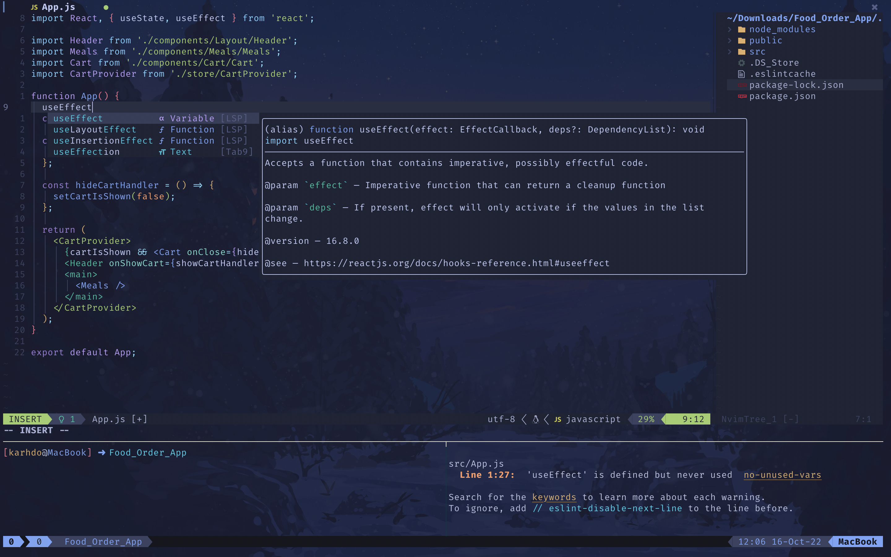

# Karhdo's dotfiles



Personal macOS dotfiles. The repo root mirrors `$HOME` and is symlinked with [GNU Stow](https://www.gnu.org/software/stow/).

## Contents

- [Fresh machine setup](#fresh-machine-setup)
- [Updating](#updating)
- [Neovim](#neovim)
- [Tmux](#tmux)
- [Window manager](#window-manager)
- [Lazygit](#lazygit)
- [Git](#git)
- [Wezterm](#wezterm)
- [Shell](#shell)
- [Bat](#bat)
- [Reference](#reference)

## Fresh machine setup

Run these in order on a brand-new macOS machine. Most steps are copy-paste.

### 1. Homebrew

```bash
/bin/bash -c "$(curl -fsSL https://raw.githubusercontent.com/Homebrew/install/HEAD/install.sh)"
```

### 2. Clone this repo

```bash
git clone https://github.com/Karhdo/dotfiles ~/Workplace/Karhdo/dotfiles
cd ~/Workplace/Karhdo/dotfiles
```

### 3. Install packages

Everything is declared in the [`Brewfile`](Brewfile):

```bash
brew bundle
```

### 4. Symlink the dotfiles

```bash
stow -t ~ .
```

`.stow-local-ignore` keeps repo-only files (`README.md`, `CLAUDE.md`, `Brewfile`, `images/`, `.git`, …) out of `$HOME`. Re-run with `stow -R -t ~ .` after adding new top-level files.

### 5. Shell plugins & integrations

```bash
# zsh plugins (sourced by .zshrc, not vendored here)
git clone https://github.com/zsh-users/zsh-autosuggestions ~/.zsh_custom/zsh-autosuggestions
git clone https://github.com/zsh-users/zsh-syntax-highlighting ~/.zsh_custom/zsh-syntax-highlighting

# fzf key bindings + completion -> creates ~/.fzf.zsh
"$(brew --prefix)/opt/fzf/install" --key-bindings --completion --no-update-rc
```

### 6. Tmux plugin manager

```bash
git clone https://github.com/tmux-plugins/tpm ~/.tmux/plugins/tpm
```

Then start tmux and press `C-t I` (prefix + I) to install plugins.

### 7. Bat themes

Theme sources are third-party clones (not tracked):

```bash
git clone https://github.com/0xTadash1/bat-into-tokyonight ~/.config/bat/bat-into-tokyonight
git clone https://github.com/folke/tokyonight.nvim ~/.config/bat/themes/tokyonight.nvim
bat cache --build
```

### 8. Java toolchain (for jdtls / kotlin LSP)

`brew install openjdk@21` is keg-only; register it so `/usr/libexec/java_home -v 21` (used in `.zshrc`) can find it:

```bash
sudo ln -sfn /opt/homebrew/opt/openjdk@21/libexec/openjdk.jdk \
  /Library/Java/JavaVirtualMachines/openjdk-21.jdk
```

### 9. Git identity (see [Git](#git) for details)

```bash
# Personal identity — NOT tracked in this repo
cat > ~/.gitconfig-karhdo <<'EOF'
[user]
    name = Karhdo
    email = karhdo.trong@gmail.com
    signingkey = ~/.ssh/karhdo.pub
EOF
```

Also set up `~/.ssh/config`, your SSH keys, `~/.ssh/allowed_signers`, and per-workspace `.envrc` files — all covered in the [Git](#git) section.

### 10. Reload & finish

```bash
source ~/.zshrc          # or open a new terminal
```

Launch Neovim once (`nvim` / `v`): [lazy.nvim](https://github.com/folke/lazy.nvim) bootstraps itself and installs all plugins, and [mason](https://github.com/williamboman/mason.nvim) pulls LSP servers/formatters automatically.

Finally, set your terminal font to **Hack Nerd Font** (installed via the Brewfile).

> The old standalone Neovim under `~/Workplace/Karhdo/nvim-macos-arm64/` is no longer used — config now relies on `brew install neovim`. You can delete that directory.

## Updating

```bash
brew bundle                 # install any newly added packages
stow -R -t ~ .              # re-link after adding top-level files
```

- Reload shell: `rz`
- Edit `.zshrc` / `init.lua`: `cz` / `cv`
- Neovim plugin versions are pinned in [.config/nvim/lazy-lock.json](.config/nvim/lazy-lock.json); commit it after `:Lazy sync`/`:Lazy update`.

## Neovim

Requires [Neovim](https://neovim.io/) **>= 0.11** (tested on 0.12.2).

- Entry point: [.config/nvim/init.lua](.config/nvim/init.lua) → loads `karhdo.core`, `karhdo.lazy`, `karhdo.lsp`.
- Plugin manager: [lazy.nvim](https://github.com/folke/lazy.nvim) — specs auto-imported from [.config/nvim/lua/karhdo/plugins/](.config/nvim/lua/karhdo/plugins/).
- LSP tooling via [mason.nvim](https://github.com/williamboman/mason.nvim); formatters via [conform.nvim](https://github.com/stevearc/conform.nvim); linters via [nvim-lint](https://github.com/mfussenegger/nvim-lint).
- Java/Kotlin: [nvim-jdtls](https://github.com/mfussenegger/nvim-jdtls) (`jdtls`) + `kotlin_lsp`, needs `openjdk@21` (step 8). `kotlin_lsp` is installed by hand — see [Kotlin LSP](#kotlin-lsp).
- Leader keys: `,` (global), `<space>` (local). Format buffer: `<leader><leader>f`.
- Lua style: tabs, single quotes (see [stylua.toml](.config/nvim/stylua.toml)); full conventions for plugins and keymaps are in [CLAUDE.md](CLAUDE.md#neovim-conventions).

### Fuzzy finding

[fzf-lua](https://github.com/ibhagwan/fzf-lua), backed by `fd` and `ripgrep`. Gitignored files are searchable; dependency/build dirs, lockfiles and binaries are excluded (lists in [fzf-lua.lua](.config/nvim/lua/karhdo/plugins/fzf-lua.lua)).

| Key | Action |
|-----|--------|
| `;f` | Find files |
| `;s` | Live grep (smart-case) |
| `;c` | Grep word under cursor |
| `;r` | Recent files in cwd |
| `;b` | Buffers |
| `;;` | Reopen last picker with its query |

Inside a picker: `C-j`/`C-k` move, `F4` toggles preview, `Esc` closes (fzf has no normal mode — use `;;` to come back).

### Kotlin LSP

JetBrains' [kotlin-lsp](https://github.com/Kotlin/kotlin-lsp) is kept out of Mason: its builds are EAP and stop starting a few months after release, and the Mason registry pins an expired one. Install the standalone archive by hand:

```bash
V=263.6379.0   # newest from https://github.com/Kotlin/kotlin-lsp/releases
D=~/.local/share/nvim/mason/packages/kotlin-lsp
mkdir -p $D && curl -fL -o /tmp/kls.sit \
  https://download.jetbrains.com/language-server/kotlin-server/$V/kotlin-server-$V-aarch64.sit
ditto -x -k /tmp/kls.sit $D && rm /tmp/kls.sit
```

Then set the same version in `kotlin_lsp_home` in [lspconfig.lua](.config/nvim/lua/karhdo/plugins/lsp/lspconfig.lua). When the server stops starting (exit code 7), repeat with the newer release. On quit, Neovim also stops the Gradle daemon the server spawns for project import.

## Tmux

Configuration: [.tmux.conf](.tmux.conf).

- Prefix: **`C-t`** (remapped from default `C-b`)
- Plugin manager: [tpm](https://github.com/tmux-plugins/tpm) at `~/.tmux/plugins/tpm/`
- Reload config: `prefix + R` (or `prefix + r`)

| Key | Action |
| --- | ------ |
| `prefix + h/j/k/l` | Move to the pane left / down / up / right (repeatable) |
| `prefix + C-h/C-j/C-k/C-l` | Resize the pane by 5 cells (repeatable) |
| `prefix + N` | Renumber windows (also happens automatically when a window closes) |

### Theme

[tmux-tokyo-night](https://github.com/fabioluciano/tmux-tokyo-night) **pinned to `v1.11.0`** — v5+ is a rewrite with a different look and extra key bindings. The status bar is transparent and shows the date and the weather for Ho Chi Minh.

tpm only honours the pin on a fresh install (its updater just runs `git pull`), so the local checkout also has its `origin` remote removed; `prefix + U` then fails for that plugin instead of upgrading it.

### Claude Code popups

[tmux-claude-hatch](https://github.com/craftzdog/tmux-claude-hatch) runs Claude Code in popups, started with `--dangerously-skip-permissions`.

| Key | Action |
| --- | ------ |
| `prefix + y` | Open Claude for the current directory |
| `prefix + Y` | Same, but a new Claude starts with `--resume` to pick a past conversation |
| `prefix + d` | Hide the popup; Claude keeps running |
| `prefix + u` | Picker of every running Claude with its status (`enter` jump, `ctrl-x` kill) |

- Each tmux session gets one popup session, keyed by the directory the tmux session started in (e.g. the `LoanBud` session → `loanbud-hq`). Inside it, every directory you open Claude from gets its own window — switch with `prefix + n/p/w`. Driven by [.config/tmux/claude-popup.sh](.config/tmux/claude-popup.sh), which overrides the plugin's `y`.
- [.config/tmux/claude.sh](.config/tmux/claude.sh) drops to a shell when Claude exits, so the popup survives; run `claude` again, or `exit` to close it.
- The optional Claude Code plugin (`/plugin install tmux-claude-hatch@tmux-claude-hatch`) rings the bell when Claude needs you, which highlights the window you launched it from.

## Window manager

[yabai](https://github.com/koekeishiya/yabai) tiles windows, [skhd](https://github.com/koekeishiya/skhd) maps the keys, and [SketchyBar](https://github.com/FelixKratz/SketchyBar) replaces the menu bar (transparent Tokyo Night). Configs: [.config/yabai/yabairc](.config/yabai/yabairc), [.config/skhd/skhdrc](.config/skhd/skhdrc), [.config/sketchybar/](.config/sketchybar/).

| Command | Action |
| ------- | ------ |
| `wmon` | Start all three and auto-hide the macOS menu bar |
| `wmoff` | Stop all three and show the macOS menu bar again |
| `wmr` | Restart all three after editing their configs |

| Key | Action |
| --- | ------ |
| `Alt+Shift+h/j/k/l` | Focus window left / down / up / right |
| `Ctrl+Alt+Shift+h/j/k/l` | Swap window in that direction |
| `Alt+Shift+m` | Toggle fill the screen |
| `Alt+Shift+f` | Toggle floating |
| `Alt+Shift+0` | Balance window sizes |
| `Alt+Shift+.` | Focus the other display |
| `Ctrl+Alt+Shift+n` | Send window to the other display |
| `Ctrl+1..6` | Switch desktop (macOS shortcut; clicking a space in the bar does the same) |

One-time setup on a new machine (after `brew bundle`):

1. **Accessibility**: allow `yabai` and `skhd` in System Settings → Privacy & Security → Accessibility.
2. **Desktop shortcuts**: enable "Switch to Desktop 1–6" (`Ctrl+1..6`) in System Settings → Keyboard → Keyboard Shortcuts → Mission Control, and create the desktops in Mission Control. yabai runs with SIP enabled, so it cannot switch or create spaces itself.
3. Run `wmon`.

## Lazygit

Configuration: [.config/lazygit/config.yml](.config/lazygit/config.yml).

Opened via toggleterm in Neovim (`<space>gg`). Pressing `e`/`o` on a file opens it in the **parent** Neovim session (not a nested instance) using Neovim's remote over the `$NVIM` socket. `.zshrc` points lazygit at this tracked config via `LG_CONFIG_FILE`, so `state.yml` stays in lazygit's default dir (out of the repo).

## Git

Configuration: [.gitconfig](.gitconfig).

### Multi-account setup

Identity and signing key swap based on workspace directory via `includeIf "gitdir:..."`:

| Workspace              | Git User           | gh CLI Account  |
| ---------------------- | ------------------ | --------------- |
| `~/Workplace/Karhdo/`  | Karhdo             | Karhdo          |
| `~/Workplace/Spartan/` | Spartan - Khanh Do | spartan-khanhdo |

Commits are GPG-signed using SSH keys (`gpg.format = ssh`), with `~/.ssh/allowed_signers` as the trust list.

### Files

- `~/.gitconfig` — main config with conditional includes
- `~/.gitconfig-karhdo` — personal account (name, email, signingkey) — **not tracked**, create locally (step 9)
- `~/.gitconfig-spartan` — work account (tracked in this repo)

**SSH config (`~/.ssh/config`):**

```ssh
# Karhdo's GitHub
Host github
  HostName github.com
  User git
  IdentityFile ~/.ssh/karhdo
  IdentitiesOnly yes

# Spartan's GitHub
Host github-spartan
  HostName github.com
  User git
  IdentityFile ~/.ssh/spartan
  IdentitiesOnly yes
```

**direnv for gh CLI (`GH_TOKEN`):**

- `~/Workplace/Karhdo/.envrc` — personal GitHub token
- `~/Workplace/Spartan/.envrc` — work GitHub token

### Generate GitHub tokens

1. Go to https://github.com/settings/tokens?type=beta
2. Generate new token with scopes: `repo`, `read:org`, `gist`
3. Create `.envrc` in workspace:

```bash
echo 'export GH_TOKEN=ghp_your_token' > ~/Workplace/YourWorkspace/.envrc
direnv allow ~/Workplace/YourWorkspace
```

## Wezterm

Configuration: [.wezterm.lua](.wezterm.lua). Installed via the Brewfile (`cask "wezterm"`).

## Shell

Configuration: [.zshrc](.zshrc).

- Prompt: [starship](https://starship.rs/) — config at [.config/starship.toml](.config/starship.toml)
- Plugins sourced from `~/.zsh_custom/`: [zsh-autosuggestions](https://github.com/zsh-users/zsh-autosuggestions), [zsh-syntax-highlighting](https://github.com/zsh-users/zsh-syntax-highlighting) (cloned in step 5)
- Fuzzy finding: [fzf](https://github.com/junegunn/fzf) + [fd](https://github.com/sharkdp/fd) + [bat](https://github.com/sharkdp/bat) preview; theme from [.fzf_tokyonight](.fzf_tokyonight)
- Tool init: [fnm](https://github.com/Schniz/fnm) (Node, auto-switch on `cd`), [zoxide](https://github.com/ajeetdsouza/zoxide), [direnv](https://direnv.net/)
- Font: [Nerd Fonts](https://github.com/ryanoasis/nerd-fonts) (Hack)

Common aliases: `v` (nvim), `rz` (reload zsh), `cz` / `cv` (edit `.zshrc` / `init.lua`), `zw` / `zs` / `zd` (jump to workspace dirs).

## Bat

Configuration: [.config/bat/](.config/bat/). Uses the `tokyonight_night` theme (set via `BAT_THEME` in `.zshrc`). Theme sources are third-party clones installed in step 7.

## Reference

- [captainko cko.nvim](https://github.com/captainko/cko.nvim)
- [josean-dev dev-environment-files](https://github.com/josean-dev/dev-environment-files)
