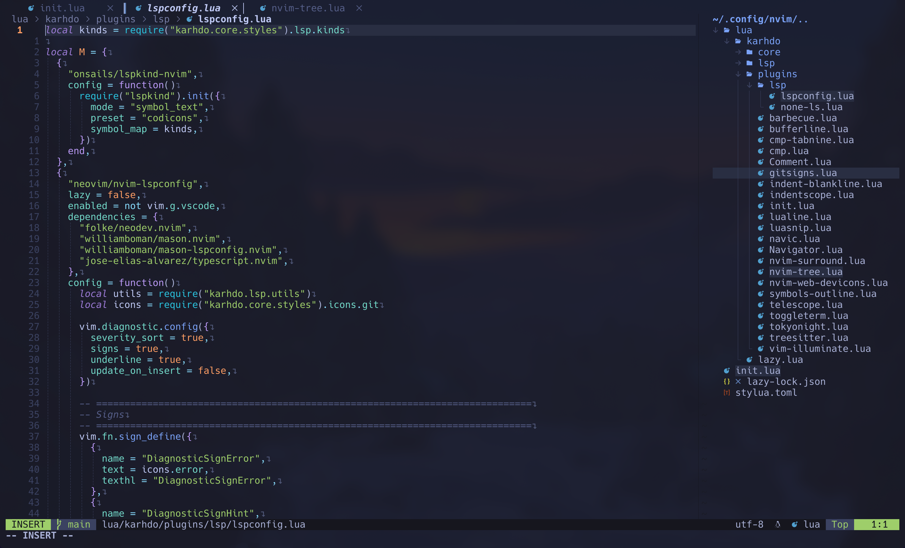

# Karhdo's dotfiles

## Contents

- NeoVim config
- tmux config
- git config
- wezterm config

## Neovim setup

Requires [Neovim](https://neovim.io/) (>= 0.8)

- [svrana/neosolarized.nvim](https://github.com/svrana/neosolarized.nvim) - A truecolor, solarized dark colorscheme
- [nvim-lualine/lualine.nvim](https://github.com/nvim-lualine/lualine.nvim) - A blazing fast and easy to configure Neovim statusline written in Lua
- [onsails/lspkind-nvim](https://github.com/onsails/lspkind-nvim) - VSCode-like pictograms
- [L3MON4D3/LuaSnip](https://github.com/L3MON4D3/LuaSnip) - Snippet Engine for Neovim written in Lua
- [hrsh7th/cmp-nvim-lsp](https://github.com/hrsh7th/cmp-nvim-lsp) - nvim-cmp source for neovim's built-in LSP
- [hrsh7th/cmp-buffer](https://github.com/hrsh7th/cmp-buffer) - nvim-cmp source for buffer words
- [hrsh7th/nvim-cmp](https://github.com/hrsh7th/nvim-cmp) - A completion engine plugin for neovim written in Lua
- [neovim/nvim-lspconfig](https://github.com/neovim/nvim-lspconfig) - A collection of configurations for Neovim's built-in LSP
- [jose-elias-alvarez/null-ls.nvim](https://github.com/jose-elias-alvarez/null-ls.nvim) - Use Neovim as a language server to inject LSP diagnostics, code actions, and more via Lua.
- [williamboman/mason.nvim](https://github.com/williamboman/mason.nvim) - Portable package manager for Neovim that runs everywhere Neovim runs. Easily install and manage LSP servers, DAP servers, linters, and formatters
- [williamboman/mason-lspconfig.nvim](https://github.com/williamboman/mason-lspconfig.nvim) - Extension to mason.nvim that makes it easier to use lspconfig with mason.nvim
- [glepnir/lspsaga.nvim](https://github.com/glepnir/lspsaga.nvim) - A light-weight lsp plugin based on neovim's built-in lsp with a highly performant UI
- [nvim-treesitter/nvim-treesitter](https://github.com/nvim-treesitter/nvim-treesitter) - [Treesitter](https://github.com/tree-sitter/tree-sitter) configurations and abstraction layer for Neovim
- [kyazdani42/nvim-web-devicons](https://github.com/kyazdani42/nvim-web-devicons) - Lua `fork` of vim-web-devicons for neovim
- [nvim-telescope/telescope.nvim](https://github.com/nvim-telescope/telescope.nvim) - A highly extendable fuzzy finder over lists
- [nvim-telescope/telescope-file-browser.nvim](https://github.com/nvim-telescope/telescope-file-browser.nvim) - File Browser extension for telescope.nvim
- [windwp/nvim-autopairs](https://github.com/windwp/nvim-autopairs) - Autopairs
- [windwp/nvim-ts-autotag](https://github.com/windwp/nvim-ts-autotag) - Use treesitter to auto close and auto rename html tag
- [norcalli/nvim-colorizer.lua](https://github.com/norcalli/nvim-colorizer.lua) - A high-performance color highlighter
- [akinsho/nvim-bufferline.lua](https://github.com/akinsho/nvim-bufferline.lua) - A snazzy bufferline
- [lewis6991/gitsigns.nvim](https://github.com/lewis6991/gitsigns.nvim) - Git integration for buffers

## Shell setup (macOS & Linux)

- [Nerd fonts](https://github.com/ryanoasis/nerd-fonts) - Powerline-patched fonts. I use Hack.
- [Exa](https://the.exa.website/) - `ls` replacement

## Reference

- [captainko cko.nvim](https://github.com/captainko/cko.nvim)

## Neovim setup

Requires [Neovim](https://neovim.io/) (>= 0.8)

### Plugins

- [nvim-lua/plenary.nvim](https://github.com/nvim-lua/plenary.nvim) - Useful lua functions used by lots of plugins
- [github/copilot.vim](https://github.com/github/copilot.vim) - GitHub Copilot plugin for Neovim
- [windwp/nvim-autopairs](https://github.com/windwp/nvim-autopairs) - A plugin for auto-closing and auto-renaming pairs
- [williamboman/mason.nvim](https://github.com/williamboman/mason.nvim) - Portable package manager for Neovim
- [williamboman/mason-lspconfig.nvim](https://github.com/williamboman/mason-lspconfig.nvim) - Extension to mason.nvim for easier LSP configuration
- [SmiteshP/nvim-navic](https://github.com/SmiteshP/nvim-navic) - Simple winbar/statusline plugin that shows your current code context
- [nvim-lualine/lualine.nvim](https://github.com/nvim-lualine/lualine.nvim) - A blazing fast and easy to configure Neovim statusline written in Lua
- [nvim-treesitter/nvim-treesitter](https://github.com/nvim-treesitter/nvim-treesitter) - Treesitter configurations and abstraction layer for Neovim
- [windwp/nvim-ts-autotag](https://github.com/windwp/nvim-ts-autotag) - Use treesitter to auto close and auto rename HTML tags
- [p00f/nvim-ts-rainbow](https://github.com/p00f/nvim-ts-rainbow) - Rainbow parentheses for Neovim using tree-sitter
- [JoosepAlviste/nvim-ts-context-commentstring](https://github.com/JoosepAlviste/nvim-ts-context-commentstring) - Neovim treesitter plugin for setting the commentstring based on the cursor location in a file
- [RRethy/vim-illuminate](https://github.com/RRethy/vim-illuminate) - Vim plugin for automatically highlighting other uses of the word under the cursor
- [nvim-tree/nvim-tree.lua](https://github.com/nvim-tree/nvim-tree.lua) - A file explorer tree for Neovim written in Lua

## Tmux setup

Configuration for Tmux can be found in [tmux/tmux.conf](tmux/tmux.conf).

## Git setup

Configuration for Git can be found in [.gitconfig](.gitconfig).

## Wezterm setup

Configuration for **Wezterm** can be found in [wezterm/](wezterm/).

## Shell setup (macOS & Linux)

- [Hack Nerd fonts](https://github.com/ryanoasis/nerd-fonts) - Powerline-patched fonts. I use Hack.
- [Exa](https://the.exa.website/) - `ls` replacement

## Reference

- [captainko cko.nvim](https://github.com/captainko/cko.nvim)
